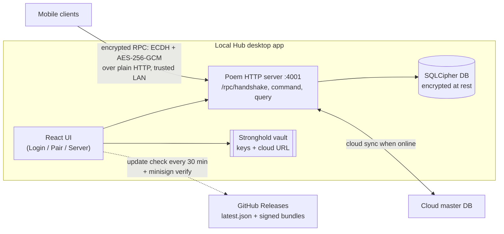

# HH Local HUB

A Tauri desktop app that acts as an **offline, LAN-local sync server** for HikmaHealth mobile
clients. It buffers sync between devices when there is no internet and later relays to the cloud
server (the master DB). It runs on a clinic machine (macOS, Windows, or Linux) on the same local
network as the mobile devices.

- [Quick start (first deployment)](#quick-start-first-deployment)
- [Architecture](#architecture)
- [Security model](#security-model-read-before-changing-transport-or-sync)
- [Prerequisites](#prerequisites)
- [Developer setup](#developer-setup)
- [Project layout](#project-layout)
- [Running the hub (operators)](#running-the-hub-operators)
- [Auto-updates](#auto-updates)
- [Testing](#testing)
- [Building & releasing](#building--releasing)
- [Configuration & secrets](#configuration--secrets)
- [Troubleshooting](#troubleshooting)

---

## Quick start (first deployment)

Getting a hub running in a clinic — no build or source checkout required:

1. **Download** the installer for the machine's OS from the
   [Releases page](https://github.com/hikmahealth/hikma-health-platform/releases): `.dmg`/`.app`
   (macOS), `.msi`/`.exe` (Windows), or `.deb`/`.rpm`/`.AppImage` (Linux).
2. **Install and launch.** On first launch, get past the OS gatekeeper — macOS: right-click →
   **Open**; Windows: **More info → Run anyway** (bundles aren't code-signed yet).
3. **Set an encryption passphrase** when prompted. This creates the encrypted database. **Store the
   passphrase safely — it cannot be recovered, and without it the data is unreadable.**
4. **Pair each mobile device** by scanning the QR code on the pairing screen.
5. **Start the server.** The hub now serves paired devices on the LAN at port `4001`.
6. **Keep the machine on the same LAN** as the devices and awake while in use. **Never expose port
   `4001` to the internet.** Internet is only needed for cloud sync and update checks.

Full detail in [Running the hub (operators)](#running-the-hub-operators).

---

## Architecture



Two halves in one process:

- **Frontend** — React 19 + Vite 7 + UnoCSS. Three screens (`src/pages/`): `Login` (encryption
  unlock), `DeviceRegistration` (pair mobile clients), `Server` (start/stop the sync server, view
  status, sync to cloud). The UI drives the backend through Tauri `invoke()` commands.
- **Backend** — Rust (`src-tauri/src/`), built on the **Poem** HTTP framework. When started it binds
  an HTTP server on `0.0.0.0:4001` for mobile clients and exposes encrypted RPC endpoints. Key
  modules: `rpc/` (handshake + command/query handlers), `crypto/` (ECDH + AES-GCM, JWT, password
  hashing), `migrations/` (refinery SQL migrations), `cloud_sync/` (relay to the master server),
  `sync_utils.rs` (WatermelonDB-style change sets).

At runtime the mobile-facing HTTP surface is just four routes:

| Route | Method | Purpose |
|---|---|---|
| `/rpc/heartbeat` | GET | Liveness probe (unauthenticated) |
| `/rpc/handshake` | POST | ECDH key exchange to establish a shared secret |
| `/rpc/command` | POST | Encrypted writes (sync push, auth, mutations) |
| `/rpc/query` | POST | Encrypted reads (sync pull, queries) |

Data lives in a **SQLCipher-encrypted SQLite** database. Secrets (signing/identity keys, the cloud
master server URL) are kept in a **Stronghold** vault (`hikma-health.stronghold`, stored next to the
executable) unlocked by the same passphrase.

## Security model (read before changing transport or sync)

- **Data at rest:** the local SQLite database is encrypted with **SQLCipher**; the key is held in
  memory and the DB is unlocked with a passphrase.
- **Data in transit — no TLS, by design.** The hub serves **plain HTTP** on `0.0.0.0:4001`.
  It cannot use transport-layer TLS because it has no CA-issued certificate, and **self-signed
  certificates are rejected by iOS App Transport Security and the Android system trust store**,
  which breaks the mobile clients. Confidentiality/integrity of PHI in transit is instead provided
  at the **application layer**: all data endpoints are `/rpc/command` and `/rpc/query`, whose
  payloads are encrypted with **ECDH-derived AES-256-GCM**. There is no unauthenticated/plaintext
  data endpoint (the legacy REST `/api/v2/sync` + `/api/login` were removed).
  This is an *addressable* HIPAA transmission-security safeguard with the app-layer envelope as the
  documented equivalent measure. **Assumes a trusted LAN — never expose port 4001 to the internet.**
- **Auth:** clients handshake (ECDH) then log in (email + password) for a JWT, which is required on
  every non-exempt RPC call.

Full transport/encryption details: [`src-tauri/src/rpc/procedures-readme.md`](src-tauri/src/rpc/procedures-readme.md).
Open security/correctness review and fix tracker: repo-root `local-test-hub-review.local.md`.

## Prerequisites

This app is part of the pnpm monorepo; install from the **repo root**, not this directory.

- **Node** `24.14.0` and **pnpm** `10.33.0` (the versions CI pins; newer patch releases are fine).
- **Rust** (stable toolchain, edition 2021) with Cargo.
- **A C toolchain** — the backend bundles SQLCipher with **vendored OpenSSL** (compiled from source),
  so a working C compiler (and `perl`/`make`) must be on `PATH`.
- **Tauri 2 system dependencies**, per OS:
  - **macOS:** Xcode Command Line Tools (`xcode-select --install`).
  - **Windows:** the WebView2 runtime and the MSVC C++ build tools.
  - **Linux (Debian/Ubuntu):** the GTK/WebKit dev libraries the CI installs:
    ```bash
    sudo apt-get install -y \
      libwebkit2gtk-4.1-dev libxdo-dev libssl-dev \
      libayatana-appindicator3-dev librsvg2-dev libglib2.0-dev libgtk-3-dev
    ```

See the [Tauri 2 prerequisites guide](https://v2.tauri.app/start/prerequisites/) for the authoritative per-OS list.

## Developer setup

```bash
# from the repo root — installs the whole workspace
pnpm install

# run the desktop app in dev mode (hot-reloading frontend + Rust)
cd apps/local-hub
pnpm tauri dev
```

`pnpm tauri dev` builds the Rust backend (first run is slow — it compiles SQLCipher/OpenSSL), starts
Vite on `localhost:1420`, and opens the desktop window. Frontend-only scripts (`package.json`):

| Command | What it does |
|---|---|
| `pnpm dev` | Vite dev server only (no Tauri shell) |
| `pnpm build` | `tsc && vite build` — type-check + build the frontend bundle |
| `pnpm tauri build` | Full native bundle (see [Building & releasing](#building--releasing)) |

## Project layout

```
apps/local-hub/
├── src/                      # React frontend
│   ├── pages/                # Login, DeviceRegistration, Server
│   ├── components/           # UpdateBanner, ThemeToggle, ui/
│   └── lib/                  # updater.ts, server-state.ts, validation.ts (+ tests)
├── src-tauri/                # Rust backend
│   ├── src/
│   │   ├── lib.rs            # Tauri commands, HTTP server, route table
│   │   ├── rpc/              # handshake + command/query handlers
│   │   ├── crypto/           # ECDH, AES-GCM, JWT, password hashing
│   │   ├── migrations/       # refinery SQL migrations
│   │   ├── cloud_sync/       # relay to the cloud master server
│   │   └── sync_utils.rs     # change-set helpers
│   ├── tauri.conf.json       # app + bundle + updater config
│   └── Cargo.toml
└── scripts/
    ├── set-version.mjs       # stamps the CalVer (+ MSI version) at release time
    └── coverage.sh
```

## Running the hub (operators)

Install a published release (see [Building & releasing](#building--releasing)) and launch it. The
setup flow, in order:

1. **Initialize / unlock encryption** (`Login` screen). On first run, set a passphrase — this creates
   the SQLCipher database and the Stronghold key vault. On later runs, enter the passphrase to unlock.
   The database and all secrets stay encrypted at rest until unlocked.
2. **Pair mobile devices** (`DeviceRegistration` screen). The hub shows pairing info as a QR code;
   each mobile client scans it to register and exchange keys with this hub.
3. **Start the server** (`Server` screen). This binds `0.0.0.0:4001` so paired devices on the LAN can
   sync. The screen shows server status, database stats, and authorized clinics.
4. **Sync to the cloud.** When the machine has internet, the hub relays buffered changes to the cloud
   master server (the URL is held in the encrypted Stronghold vault). Offline, it keeps buffering.
5. **Lock when unattended.** Locking clears the in-memory key; the DB returns to encrypted-at-rest.

Maintenance actions exposed by the app include rotating the encryption key and clearing all local
data. **Keep the machine on the trusted clinic LAN — never port-forward `4001` to the internet.**

## Auto-updates

The hub checks for new versions using Tauri's updater plugin:

- On the `Server` screen, `UpdateBanner` calls `check()` on launch and **every 30 minutes**.
- `check()` fetches the updater manifest from
  `https://github.com/hikmahealth/hikma-health-platform/releases/latest/download/latest.json` and
  compares its version to the running app's compiled CalVer.
- If newer, a banner offers **Install & Restart**: the platform artifact is downloaded, its **minisign
  signature is verified** against the `pubkey` in `tauri.conf.json`, installed, and the app relaunches.

Only **published** releases are visible (the endpoint is `/releases/latest`, which excludes drafts),
and the check requires internet — offline, the banner shows a retryable error. There is no silent
auto-install; the operator must click to apply.

## Testing

```bash
# from the repo root
just test-local-hub         # frontend (vitest) + backend (cargo nextest)
just ci-local               # lockfile check + tests + unsigned bundle smoke-build (mirrors CI)
```

Or directly: `pnpm --filter hh-local-hub run test:frontend` / `test:backend`. `pnpm coverage`
(`scripts/coverage.sh`) produces a coverage report. CI runs the frontend tests on every PR and gates
the backend tests + a bundle build on changes under `src-tauri/**`.

## Building & releasing

Releases are built by the **Local Hub Release** workflow (`.github/workflows/local-hub-release.yaml`):
run it from the Actions tab and supply a **CalVer** version like `2026.5.4` (or `2026.5.4-2` for a
second release the same day). It runs the test suite, then builds macOS, Windows, and Linux bundles,
signs the updater artifacts with minisign, and uploads everything to a **draft** GitHub Release.

- `scripts/set-version.mjs` stamps the version across `package.json`, `tauri.conf.json`, and
  `Cargo.toml`. It also derives an MSI-legal version for Windows — Windows Installer caps the major
  version field at 255, so the CalVer is mapped to `(YYYY-2000).M.D[.N]` in
  `bundle.windows.wix.version`. The auto-updater still compares the real CalVer, so update detection
  keeps full resolution; only the Windows installer's internal version uses the mapping.
- The draft stays hidden until you **publish** it. Only published releases are picked up by the
  in-app updater and shown on the public Releases page.

Bundles are **not OS-code-signed yet**, so first launch trips the platform gatekeepers:

- **macOS:** right-click the app → **Open**, then confirm (Gatekeeper blocks double-click launch of
  unsigned/unnotarized apps).
- **Windows:** on the SmartScreen prompt click **More info → Run anyway**.

Apple notarization and Windows Authenticode signing are a planned follow-up.

## Configuration & secrets

- **`src-tauri/tauri.conf.json`** — app identity, bundle targets, and the `updater` block (the
  `pubkey` used to verify updates, and the `latest.json` endpoint).
- **Release signing (CI secrets):** `TAURI_SIGNING_PRIVATE_KEY` and `TAURI_SIGNING_PRIVATE_KEY_PASSWORD`
  are the minisign key/password used to sign updater artifacts. Their public counterpart is the
  `pubkey` in `tauri.conf.json`. If the key is lost it can be regenerated, but the new `pubkey` must
  replace the old one (this is safe only before any release is published, since installed clients
  trust the embedded key).
- **Runtime secrets:** the SQLCipher key and the cloud master server URL live in the encrypted
  Stronghold vault (`hikma-health.stronghold`), unlocked by the operator's passphrase. None of these
  are environment variables.

## Troubleshooting

- **`No podspec found` / stale Tauri build:** a JS↔Rust Tauri plugin version mismatch (e.g.
  `tauri-plugin-fs` JS vs crate on different minors) makes `tauri build` abort with a version-parity
  error. Align the Rust crate to the JS version (`cargo update -p <crate> --precise <version>`).
- **Update check fails:** the hub needs internet to reach github.com, and only **published** releases
  are visible. A draft release will never appear in the banner.
- **`Address already in use` on start:** another process holds `4001`. Stop it, or stop and restart
  the server from the `Server` screen.
- **Random pod/crate fails differently each build (errno 28 / ENOSPC):** the build disk is full;
  check `df -h` before debugging individual dependencies.
- **First Rust build is very slow:** expected — SQLCipher and OpenSSL are compiled from source. The
  cargo cache makes subsequent builds fast.
